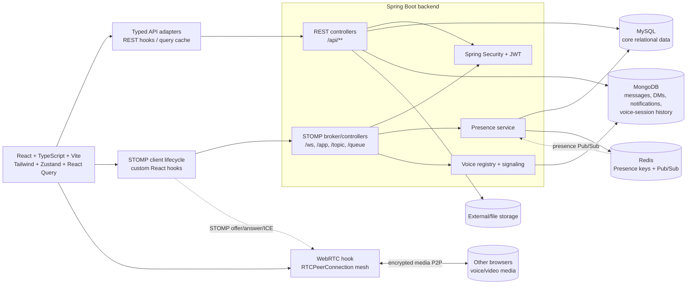

# Cococord Migration Foundation Document

This document is the architectural boundary for migrating the current Spring Boot/JSP/vanilla-JS monolith to a decoupled React client. It treats the existing REST DTOs and STOMP destinations as the compatibility contract. Frontend adapters normalize those wire shapes into the domain types below; no controller or persistence refactor is implied by this document.

## 1. AI System Instructions (`.clinerules` / `ai-instructions.md`)

The following is the exact initial content for `.clinerules`:

```text
# Cococord AI Engineering Rules

## Mission

Build Cococord as a decoupled, typed React client over the existing Spring Boot API. Preserve existing REST response shapes, request validation, JWT behavior, STOMP destinations, and WebRTC signaling semantics unless a migration task explicitly approves a backend contract change.

## Target technology stack

- ReactJS with functional components and hooks only.
- TypeScript in strict mode; prefer explicit interfaces, discriminated unions, and type-safe API clients.
- Vite for development and production bundling.
- React Router for route composition and protected routes.
- Tailwind CSS for all styling; use a small, documented token layer for brand colors and spacing.
- Zustand for client-owned global state: authentication/session, navigation selection, presence cache, realtime connection status, and voice UI state.
- TanStack React Query for server state, caching, pagination, invalidation, optimistic updates, and request lifecycle state.
- @stomp/stompjs for STOMP over WebSocket. Use SockJS only when the deployment requires the existing /ws fallback endpoint.
- Native WebRTC APIs (RTCPeerConnection, MediaStream, getUserMedia, getDisplayMedia) for voice/video media.
- Zod (or an equivalent runtime validator) at API/WebSocket boundaries when a response is not already guaranteed by a generated schema.
- ESLint, Prettier, and Vitest/React Testing Library for quality and tests.

## Non-negotiable coding conventions

- Write functional React components; do not add class components.
- Use TypeScript for every new frontend file. Do not use `any`; use `unknown` plus narrowing at untrusted boundaries.
- Prefer named exports, small cohesive modules, and one primary responsibility per file.
- Use `PascalCase` for components/types, `camelCase` for functions/variables, and `SCREAMING_SNAKE_CASE` only for constants.
- Keep domain types separate from transport DTOs. Add explicit `fromXxxDto`/`toXxxRequest` adapters instead of leaking backend naming into JSX.
- Use `import type` for type-only imports.
- Prefer immutable updates and functional state updates.
- Keep render functions pure. Side effects belong in hooks, services, or event handlers.
- Handle loading, empty, error, unauthorized, and stale states explicitly.
- Tailwind classes are the styling source of truth. Do not add inline `style={{...}}`, CSS-in-JS, or ad-hoc DOM mutation.
- Do not introduce a second styling system or duplicate Tailwind utility strings without extracting a reusable variant/helper.
- Accessibility is required: semantic elements, keyboard support, labels, focus states, and appropriate ARIA attributes.

## Architectural rules

- Components render state and dispatch intent; they do not call `fetch`, Axios, STOMP, or WebRTC directly.
- REST access is isolated in `src/api/*` and consumed by custom hooks built on TanStack Query (`useCurrentUser`, `useServers`, `useChannelMessages`, etc.).
- WebSocket access is isolated in a singleton/provider plus custom hooks (`useStompConnection`, `useStompSubscription`, `useChannelRealtime`, `usePresenceRealtime`).
- Every subscription hook must unsubscribe in effect cleanup and must use stable callback refs so handler changes do not recreate subscriptions.
- WebSocket connection creation, reconnect, token refresh, and deactivation are lifecycle-owned. Never create a client during render.
- WebRTC access is isolated in hooks/services (`useVoiceRoom`, `usePeerConnection`). Store serializable participant state in Zustand; keep RTCPeerConnection and MediaStream objects in refs/services.
- Every RTCPeerConnection, MediaStream track, analyser, timer, and subscription must have an explicit cleanup path.
- Never put a Promise, WebSocket, STOMP Client, RTCPeerConnection, MediaStream, or DOM node in Zustand or React Query data.
- TanStack Query owns server state. Zustand must not mirror entire query results; store only selections, ephemeral UI state, and client-owned connection state.
- Use normalized maps keyed by IDs for high-churn collections such as presence, participants, and message drafts.
- Respect the existing ID split: MySQL `Long` values are numeric IDs; MongoDB document IDs are strings.
- Treat timestamps as ISO-8601 strings at the frontend boundary and format them only at presentation time.
- Never trust sender IDs or permissions supplied by the browser; the backend remains authoritative.
- Do not log access tokens, refresh tokens, SDP, ICE candidates, message content, or personal data in production.

## Existing realtime contract to preserve

- STOMP endpoint: `/ws`; application prefix: `/app`; broker prefixes: `/topic`, `/queue`; user prefix: `/user`.
- JWT is sent in the STOMP CONNECT `Authorization: Bearer <accessToken>` native header.
- Channel messages publish to `/app/chat.sendMessage`, edit to `/app/chat.editMessage`, delete to `/app/chat.deleteMessage`, typing to `/app/chat.typing`.
- Channel events are received on `/topic/channel/{channelId}` and deletion on `/topic/channel/{channelId}/delete`.
- DM events use `/app/dm.*` and `/topic/dm/{dmGroupId}` (typing and delete may use suffixes).
- Presence snapshots use `GET /api/presence/users?ids=...`; realtime presence uses `/topic/presence`, `/user/queue/presence`, and `/topic/server.{serverId}.presence`.
- Voice-room presence/state uses `/app/voice/join`, `/app/voice/leave`, `/app/voice/state` and `/topic/voice/{channelId}`.
- Voice signaling uses `/app/voice/signal/{offer|answer|ice}` and `/topic/voice/{channelId}/signal`.
- One-to-one call signaling uses `/app/call.signal`, `/topic/call/{roomId}`, and `/topic/user.{userId}.calls`.

## Migration discipline

- Work in the roadmap order in `MIGRATION_FOUNDATION.md`.
- Before changing a backend controller, document the current request, response, destination, authorization, and error behavior and add compatibility tests.
- Do not write functional React screens or backend refactors until the foundation types, API client, query keys, and realtime lifecycle primitives are approved.
- Prefer additive changes and feature flags. Keep the JSP client usable until the React route has parity and an explicit cutover decision.
```

## 2. Visual Architecture Graph (Mermaid.js)



Data ownership is deliberate: MySQL remains authoritative for users, servers, memberships, channels, categories, roles, permissions, invites, sessions, and moderation records. MongoDB remains authoritative for channel messages, direct messages, notifications, read receipts, typing indicators, presence documents, forum posts, and voice-session history. Redis is infrastructure state for distributed presence and Pub/Sub; the browser never connects to Redis directly. STOMP carries commands/events and WebRTC carries media; SDP/ICE are signaling payloads only.

## 3. Core Type Definitions (TypeScript Interfaces)

The following types are the normalized frontend domain model. Transport adapters should map Java DTO names (`isPublic`, `isEdited`, etc.) to the same names unless a UI-friendly alias is explicitly justified. Java `Long` IDs are represented as `number`; MongoDB IDs remain `string`; `LocalDateTime` values are ISO strings.

```ts
export type MysqlId = number;
export type MongoId = string;
export type IsoDateTime = string;

export type UserStatus =
  | 'ONLINE'
  | 'IDLE'
  | 'DO_NOT_DISTURB'
  | 'OFFLINE'
  | 'INVISIBLE';

export type GlobalRole = 'USER' | 'MODERATOR' | 'ADMIN';

export interface PublicUser {
  id: MysqlId;
  username: string;
  displayName?: string | null;
  avatarUrl?: string | null;
  bannerUrl?: string | null;
  discriminator?: string | null;
  status?: UserStatus;
  customStatus?: string | null;
  customStatusEmoji?: string | null;
  customStatusExpiresAt?: IsoDateTime | null;
}

export interface User extends PublicUser {
  email?: string | null;
  phone?: string | null;
  bio?: string | null;
  pronouns?: string | null;
  theme?: 'LIGHT' | 'DARK' | string | null;
  messageDisplay?: 'COMPACT' | 'COZY' | string | null;
  role?: GlobalRole | string | null;
  isActive?: boolean;
  isBanned?: boolean;
  bannedAt?: IsoDateTime | null;
  bannedUntil?: IsoDateTime | null;
  banReason?: string | null;
  isMuted?: boolean;
  mutedUntil?: IsoDateTime | null;
  muteReason?: string | null;
  isEmailVerified?: boolean;
  twoFactorEnabled?: boolean;
  allowFriendRequests?: boolean;
  allowDirectMessages?: boolean;
  lastLogin?: IsoDateTime | null;
  createdAt?: IsoDateTime | null;
  serverCount?: number;
  messageCount?: number;
  note?: string | null;
  mutualServers?: Server[];
  badges?: string[];
}

export interface AuthResponse {
  accessToken: string;
  refreshToken: string;
  tokenType: 'Bearer' | string;
  expiresIn: number;
  userId: MysqlId;
  username: string;
  email: string;
  displayName?: string | null;
  avatarUrl?: string | null;
  role: GlobalRole | string;
  loginAt?: IsoDateTime | null;
}

export interface Server {
  id: MysqlId;
  name: string;
  description?: string | null;
  iconUrl?: string | null;
  bannerUrl?: string | null;
  ownerId: MysqlId;
  ownerUsername?: string | null;
  ownerEmail?: string | null;
  ownerAvatarUrl?: string | null;
  isPublic: boolean;
  maxMembers: number;
  memberCount?: number;
  channelCount?: number;
  roleCount?: number;
  isLocked: boolean;
  lockReason?: string | null;
  lockedAt?: IsoDateTime | null;
  lockedUntil?: IsoDateTime | null;
  isSuspended: boolean;
  suspendReason?: string | null;
  suspendedAt?: IsoDateTime | null;
  suspendedUntil?: IsoDateTime | null;
  lastActivityAt?: IsoDateTime | null;
  createdAt?: IsoDateTime | null;
  updatedAt?: IsoDateTime | null;
  channels?: Channel[];
  categories?: Category[];
  roles?: Role[];
}

export interface Category {
  id: MysqlId;
  serverId: MysqlId;
  name: string;
  position: number;
  createdAt?: IsoDateTime | null;
  updatedAt?: IsoDateTime | null;
}

export type ChannelType = 'TEXT' | 'VOICE' | 'ANNOUNCEMENT' | 'STAGE' | 'FORUM';

export interface Channel {
  id: MysqlId;
  serverId: MysqlId;
  categoryId?: MysqlId | null;
  categoryName?: string | null;
  name: string;
  type: ChannelType | string;
  topic?: string | null;
  position: number;
  isPrivate: boolean;
  isNsfw: boolean;
  isDefault: boolean;
  slowMode: number;
  bitrate: number;
  userLimit: number;
  createdAt?: IsoDateTime | null;
  updatedAt?: IsoDateTime | null;
}

export interface ServerMember {
  id: MysqlId;
  serverId: MysqlId;
  userId: MysqlId;
  username: string;
  displayName?: string | null;
  avatarUrl?: string | null;
  roleId?: MysqlId | null;
  roleName?: string | null;
  nickname?: string | null;
  isMuted: boolean;
  isDeafened: boolean;
  joinedAt?: IsoDateTime | null;
}

export interface Role {
  id: MysqlId;
  serverId: MysqlId;
  name: string;
  color: string;
  position: number;
  isHoisted: boolean;
  isMentionable: boolean;
  isDefault: boolean;
  createdAt?: IsoDateTime | null;
  updatedAt?: IsoDateTime | null;
}

export type PermissionTargetType = 'USER' | 'ROLE';

export interface ChannelPermissionOverride {
  id: MysqlId;
  channelId: MysqlId;
  targetType: PermissionTargetType;
  targetId: MysqlId;
  allowedPermissions: string[];
  deniedPermissions: string[];
  targetName?: string | null;
  avatarUrl?: string | null;
  color?: string | null;
}

export interface ComputedPermissions {
  userId: MysqlId;
  channelId: MysqlId;
  finalBitmask: number;
  allowedPermissions: string[];
  isServerOwner: boolean;
  isAdministrator: boolean;
  canViewChannel: boolean;
  canSendMessages: boolean;
  canManageMessages: boolean;
  canConnect: boolean;
  canSpeak: boolean;
}

export type MessageType =
  | 'TEXT'
  | 'IMAGE'
  | 'FILE'
  | 'AUDIO'
  | 'VIDEO'
  | 'STICKER'
  | 'GIF'
  | 'SYSTEM'
  | 'ANNOUNCEMENT';

export interface Attachment {
  id?: string;
  fileName: string;
  fileUrl: string;
  fileType: string;
  fileSize: number;
  thumbnailUrl?: string | null;
  width?: number | null;
  height?: number | null;
}

export interface Reaction {
  emoji: string;
  emojiId?: string | null;
  userIds: MysqlId[];
  count: number;
  usernames?: string[];
  hasReacted?: boolean;
}

export interface EmbedAuthor {
  name: string;
  url?: string | null;
  iconUrl?: string | null;
}

export interface EmbedField {
  name: string;
  value: string;
  inline?: boolean | null;
}

export interface Embed {
  title?: string | null;
  description?: string | null;
  url?: string | null;
  color?: string | null;
  thumbnailUrl?: string | null;
  imageUrl?: string | null;
  timestamp?: IsoDateTime | null;
  author?: EmbedAuthor | null;
  fields?: EmbedField[];
}

export interface EditHistoryEntry {
  oldContent: string;
  editedAt: IsoDateTime;
}

export interface Message {
  id: MongoId;
  channelId: MysqlId;
  serverId?: MysqlId | null;
  userId: MysqlId;
  username: string;
  displayName?: string | null;
  avatarUrl?: string | null;
  content?: string | null;
  type: MessageType | string;
  parentMessageId?: MongoId | null;
  threadId?: MongoId | null;
  metadata?: string | null;
  attachments: Attachment[];
  embeds: Embed[];
  mentionedUserIds: MysqlId[];
  mentionedRoleIds: MysqlId[];
  mentionEveryone: boolean;
  reactions: Reaction[];
  isEdited: boolean;
  editedAt?: IsoDateTime | null;
  editHistory: EditHistoryEntry[];
  isDeleted: boolean;
  deletedAt?: IsoDateTime | null;
  deletedBy?: MysqlId | null;
  isPinned: boolean;
  pinnedAt?: IsoDateTime | null;
  pinnedBy?: MysqlId | null;
  createdAt: IsoDateTime;
}

export interface DirectMessage extends Omit<Message, 'channelId' | 'serverId'> {
  dmGroupId: MysqlId;
  callId?: string | null;
  callVideo?: boolean | null;
  callDurationSeconds?: number | null;
  readBy: MysqlId[];
}

export interface DirectMessageGroup {
  id: MysqlId;
  name?: string | null;
  ownerId: MysqlId;
  ownerUsername?: string | null;
  isGroup: boolean;
  iconUrl?: string | null;
  createdAt?: IsoDateTime | null;
  updatedAt?: IsoDateTime | null;
  members: DirectMessageMember[];
}

export interface DirectMessageMember {
  id: MysqlId;
  userId: MysqlId;
  username: string;
  displayName?: string | null;
  avatarUrl?: string | null;
  joinedAt?: IsoDateTime | null;
  isMuted?: boolean;
  lastReadAt?: IsoDateTime | null;
}

export interface ForumPost {
  id: MongoId;
  channelId: MysqlId;
  serverId: MysqlId;
  authorId: MysqlId;
  authorUsername: string;
  authorDisplayName?: string | null;
  authorAvatarUrl?: string | null;
  title: string;
  imageUrl: string;
  content?: string | null;
  reactions: Reaction[];
  commentCount: number;
  isPinned: boolean;
  isLocked: boolean;
  createdAt?: IsoDateTime | null;
  updatedAt?: IsoDateTime | null;
}

export interface FriendRequest {
  id: MysqlId;
  senderId: MysqlId;
  senderUsername: string;
  senderDisplayName?: string | null;
  senderAvatarUrl?: string | null;
  receiverId: MysqlId;
  receiverUsername: string;
  receiverDisplayName?: string | null;
  receiverAvatarUrl?: string | null;
  status: 'PENDING' | 'ACCEPTED' | 'REJECTED' | 'CANCELLED' | string;
  createdAt?: IsoDateTime | null;
  respondedAt?: IsoDateTime | null;
}

export interface InviteLink {
  id: MysqlId;
  serverId: MysqlId;
  channelId?: MysqlId | null;
  createdBy: MysqlId;
  code: string;
  maxUses: number;
  currentUses: number;
  expiresAt?: IsoDateTime | null;
  isActive: boolean;
  createdAt?: IsoDateTime | null;
}

export interface ApiPage<T> {
  content: T[];
  number: number;
  size: number;
  totalElements: number;
  totalPages: number;
  first: boolean;
  last: boolean;
  numberOfElements: number;
  empty: boolean;
}

export interface Notification {
  id: MongoId | MysqlId;
  recipientId?: MysqlId;
  senderId?: MysqlId | null;
  senderUsername?: string | null;
  senderDisplayName?: string | null;
  senderAvatarUrl?: string | null;
  type: 'SERVER_INVITE' | 'FRIEND_REQUEST' | 'MENTION' | 'SYSTEM' | string;
  relatedEntityId?: MysqlId | null;
  relatedEntityName?: string | null;
  inviteCode?: string | null;
  message?: string | null;
  isRead: boolean;
  isActedUpon?: boolean;
  actionResult?: 'ACCEPTED' | 'DECLINED' | 'EXPIRED' | null;
  createdAt?: IsoDateTime | null;
  expiresAt?: IsoDateTime | null;
}

export interface Presence {
  userId: MysqlId;
  username?: string;
  status: UserStatus;
  customStatus?: string | null;
  customStatusEmoji?: string | null;
  lastSeen?: IsoDateTime | null;
  deviceType?: 'WEB' | 'MOBILE' | 'DESKTOP' | string;
  isMobile?: boolean;
  updatedAt?: IsoDateTime | null;
}

export interface ReadReceipt {
  id: MongoId;
  channelId: MysqlId;
  userId: MysqlId;
  lastReadMessageId?: MongoId | null;
  lastReadAt: IsoDateTime;
  unreadCount: number;
  unreadMentions: number;
  updatedAt: IsoDateTime;
}

export interface TypingIndicator {
  id: MongoId;
  channelId: MysqlId;
  userId: MysqlId;
  username: string;
  displayName?: string | null;
  context: 'SERVER' | 'DM';
  startedAt: IsoDateTime;
  expiresAt: IsoDateTime;
}

export interface VoiceParticipant extends PublicUser {
  micOn: boolean;
  camOn: boolean;
  screenOn: boolean;
  speaking: boolean;
  isMuted?: boolean;
  isDeafened?: boolean;
  isCameraOn?: boolean;
  isScreenSharing?: boolean;
  joinedAt?: IsoDateTime | null;
  leftAt?: IsoDateTime | null;
  connectionId?: string | null;
}

export interface VoiceSession {
  id: MongoId;
  channelId: MysqlId;
  serverId?: MysqlId | null;
  participants: VoiceParticipant[];
  startedAt: IsoDateTime;
  endedAt?: IsoDateTime | null;
  isActive: boolean;
}

export interface VoiceStateUpdate {
  channelId: MysqlId;
  userId: MysqlId;
  micOn?: boolean;
  camOn?: boolean;
  screenOn?: boolean;
  speaking?: boolean;
}

export interface VoiceSignal {
  type: 'OFFER' | 'ANSWER' | 'ICE';
  channelId: MysqlId;
  fromUserId: MysqlId;
  toUserId: MysqlId;
  sdp?: string;
  candidate?: RTCIceCandidateInit | Record<string, unknown>;
}

export interface CallSignal {
  type: 'CALL_START' | 'OFFER' | 'ANSWER' | 'ICE' | 'HANGUP' | string;
  roomId: string;
  callId?: string;
  fromUserId?: MysqlId;
  fromUsername?: string;
  targetUserId?: MysqlId;
  video?: boolean;
  sdp?: string;
  candidate?: string;
  sdpMid?: string;
  sdpMLineIndex?: number;
}

export interface WebSocketEvent<TPayload = unknown> {
  type: string;
  payload: TPayload;
}
```

Transport-only types should remain in `src/api/contracts` when they differ from the domain model. Notable examples from the current source are: `ChatMessageResponse` omits Mongo reactions/embeds/pin fields; `DirectMessageController` returns raw Mongo documents; `/api/auth/me` returns a map rather than `UserProfileResponse`; and notification responses use a legacy numeric-shaped DTO while Mongo notifications use string IDs. Adapters must handle these differences deliberately and tests must lock the mapping down.

## 4. State Management & WebSocket Strategy

### Zustand store

Use one store with bounded slices, or multiple stores if a slice becomes independently testable. The initial shape is:

```ts
interface CococordStore {
  auth: {
    currentUser: User | null;
    accessToken: string | null;
    refreshToken: string | null;
    expiresAt: number | null;
    status: 'unknown' | 'authenticated' | 'anonymous';
    setSession: (session: AuthResponse) => void;
    clearSession: () => void;
  };
  navigation: {
    activeServerId: MysqlId | null;
    activeChannelId: MysqlId | null;
    activeDmGroupId: MysqlId | null;
    setActiveServer: (id: MysqlId | null) => void;
    setActiveChannel: (id: MysqlId | null) => void;
    setActiveDmGroup: (id: MysqlId | null) => void;
  };
  presence: {
    byUserId: Record<MysqlId, Presence>;
    onlineFriends: MysqlId[];
    upsert: (presence: Presence) => void;
    remove: (userId: MysqlId) => void;
  };
  realtime: {
    status: 'idle' | 'connecting' | 'connected' | 'reconnecting' | 'error';
    lastError: string | null;
    setStatus: (status: CococordStore['realtime']['status']) => void;
    setError: (message: string | null) => void;
  };
  voice: {
    activeSession: VoiceSession | null;
    participantsByUserId: Record<MysqlId, VoiceParticipant>;
    local: { micOn: boolean; camOn: boolean; screenOn: boolean; speaking: boolean };
    setSession: (session: VoiceSession | null) => void;
    upsertParticipant: (participant: VoiceParticipant) => void;
    removeParticipant: (userId: MysqlId) => void;
    setLocalState: (state: Partial<CococordStore['voice']['local']>) => void;
  };
}
```

TanStack Query owns `currentUser` revalidation, server/channel/member/role lists, paged messages, DM history, notification lists, and permission snapshots. Zustand owns only the current selection, token/connection lifecycle, presence deltas, and ephemeral voice/UI state. Derive `onlineFriends` with a selector from the presence map or update it atomically when friend data is available; do not duplicate full user records in several stores.

### STOMP lifecycle

1. Create exactly one `Client` in a provider or module-level connection service, never during render. Use `webSocketFactory` for SockJS fallback or `brokerURL` for native `ws(s)` deployments.
2. Read the current access token only when activating/reconnecting. Send `Authorization: Bearer <token>` in `connectHeaders`, matching `WebSocketSecurityConfig`.
3. Configure bounded exponential reconnect, connection/error callbacks, and heartbeats. On token refresh, deactivate the old client before activating the new one.
4. `useStompSubscription(destination, handler, enabled)` keeps `handler` in a ref, subscribes only after `onConnect`, and returns an idempotent cleanup that calls `unsubscribe`.
5. Resubscribe all active destinations after reconnect. Store subscription handles outside React state; expose only serializable connection status through Zustand.
6. Parse JSON once at the boundary, validate the event envelope, and route by `type`. Use exact existing destinations, including `/topic/channel/{id}`, `/topic/dm/{id}`, `/topic/presence`, `/user/queue/presence`, `/topic/user.{id}.notifications`, `/topic/user.{id}.calls`, and both voice topic families.
7. Publish commands through a stable `publish(destination, body)` callback. Components call domain hooks such as `useChannelRealtime` instead of knowing `/app/chat.sendMessage`.

### WebRTC lifecycle

- `useVoiceRoom(channelId)` owns a `Map<MysqlId, RTCPeerConnection>` in a ref, one local `MediaStream` in a ref, and subscriptions to `/topic/voice/{channelId}` plus `/topic/voice/{channelId}/signal`.
- Join with `/app/voice/join`; use the authenticated user ID as the sender identity. Filter incoming signals by `toUserId` before mutating a peer connection.
- Create offers/answers and add ICE candidates only in response to lifecycle events. Guard against duplicate negotiation with a per-peer status/ref and `negotiationneeded` throttling.
- Add local tracks exactly once per peer. Handle `ontrack`, `onicecandidate`, `onconnectionstatechange`, and `oniceconnectionstatechange`; remove failed peers and allow a controlled retry.
- Keep `RTCPeerConnection`, `MediaStream`, `MediaStreamTrack`, `AudioContext`, and timers out of Zustand. Store only participant metadata and local booleans.
- On channel/user change or unmount: publish `/app/voice/leave`, unsubscribe, stop every local track, close every peer connection, detach media elements, clear timers/analyser nodes, and reset the voice slice. Cleanup must be safe when called more than once.
- Do not use `useEffect` dependencies containing freshly created objects/functions. Memoize configuration, use refs for mutable resources, and separate connection effects from state-rendering effects to prevent infinite loops.

## 5. Phased Migration Roadmap

### Phase 0 — Foundation and contract lock

- Add the `.clinerules` content above, strict TypeScript configuration, environment schema, API error envelope, query-key factory, transport/domain adapters, and the interfaces in this document.
- Inventory every REST endpoint and STOMP destination; add contract fixtures for auth, server/channel, message, DM, presence, and voice events.
- Decide the canonical frontend date/ID conventions and document the raw-DM/raw-message exceptions.
- Exit when the React app can parse representative existing responses without rendering UI.

### Phase 1 — REST API decoupling

- Build a typed HTTP client with base URL, bearer injection, 401 refresh/retry, abort signals, multipart upload support, and normalized error handling.
- Add React Query hooks for `/api/auth`, `/api/servers`, `/api/servers/{id}`, `/api/{servers|channels}/...`, `/api/messages`, `/api/direct-messages`, `/api/users`, `/api/friends`, `/api/notifications`, and `/api/presence`.
- Establish query keys and invalidation rules. Keep mutation side effects in hooks/services, not components.
- Exit when read-only data can be fetched and inspected through typed hooks against the running monolith.

### Phase 2 — Authentication UI and Zustand setup

- Implement token/session persistence, login/register/refresh/logout flows, protected routing, `/api/auth/me` hydration, and the initial Zustand slices.
- Handle refresh-token rotation and cross-tab logout without logging secrets. Keep access-token expiry visible to the connection service.
- Exit when a user can authenticate, refresh, reload, and reach a protected React route while the JSP app remains operational.

### Phase 3 — App shell, servers, channels, permissions

- Migrate navigation and server/channel selection using `Server`, `Category`, `Channel`, `ServerMember`, `Role`, and `ComputedPermissions` adapters.
- Render only after permission-aware queries resolve; do not infer authorization from hidden UI controls.
- Exit when server/channel navigation and permission-gated placeholders match existing behavior.

### Phase 4 — STOMP realtime messaging, presence, DMs, notifications

- Introduce the singleton STOMP provider and subscription hooks. Migrate channel message create/edit/delete, typing, reactions, mentions, presence, friend events, notifications, and DM events.
- Reconcile event names (`message.created` versus legacy uppercase reaction events) in one event router. Apply idempotent updates to query caches.
- Exit when reconnect, route changes, logout, and token refresh produce no duplicate subscriptions or stale updates.

### Phase 5 — WebRTC voice rooms and 1:1 calls

- Implement `useVoiceRoom` for `/app/voice/join|leave|state` and targeted offer/answer/ICE signaling. Then migrate `/app/call.signal` for DM calls.
- Add permission checks (`CONNECT`, `SPEAK`, `VIDEO`, `STREAM`) before acquiring media. Provide device permission errors and graceful fallback to audio-only.
- Exit when joining/leaving, peer failure, tab close, screen-share stop, and logout release every media and peer resource.

### Phase 6 — Hardening and cutover

- Add contract, adapter, hook, store, reconnect, and WebRTC cleanup tests; run accessibility and performance checks for virtualized message history.
- Add observability for API latency, query errors, STOMP reconnects, subscription counts, WebRTC connection states, and media permission failures without sensitive payloads.
- Roll out by route/feature flag, compare React and JSP behavior, then remove legacy pages only after parity and rollback criteria are met.
