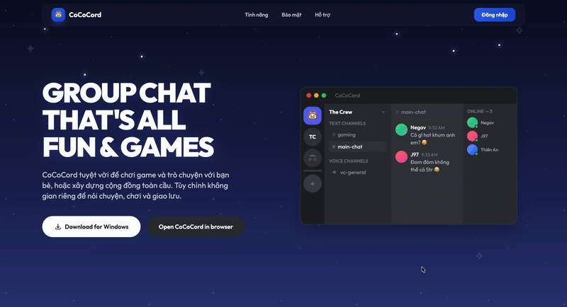
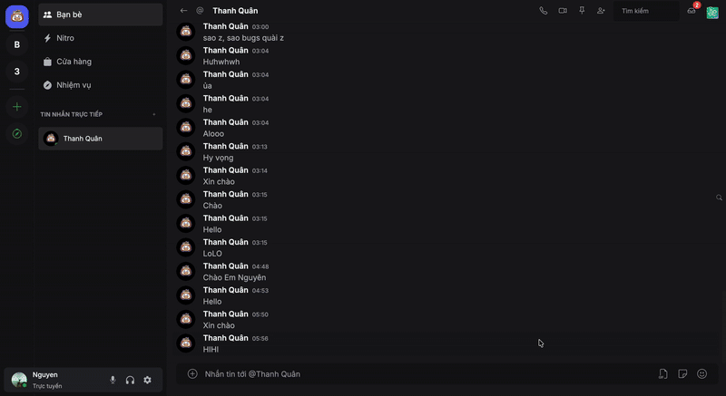
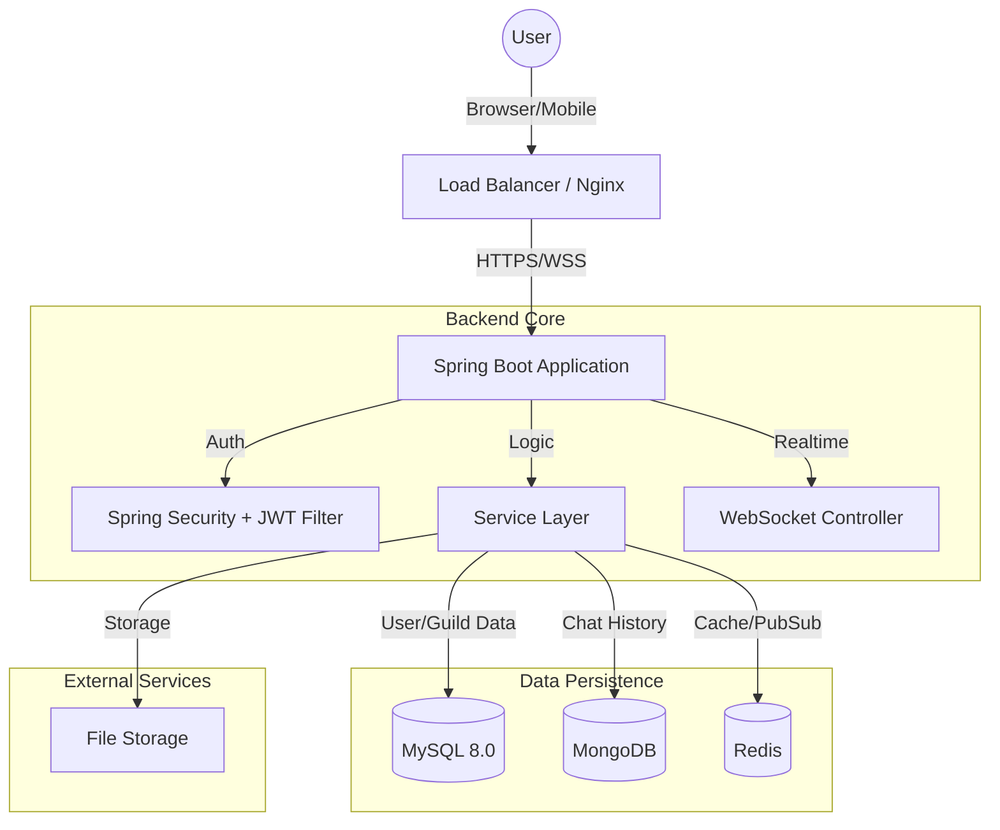
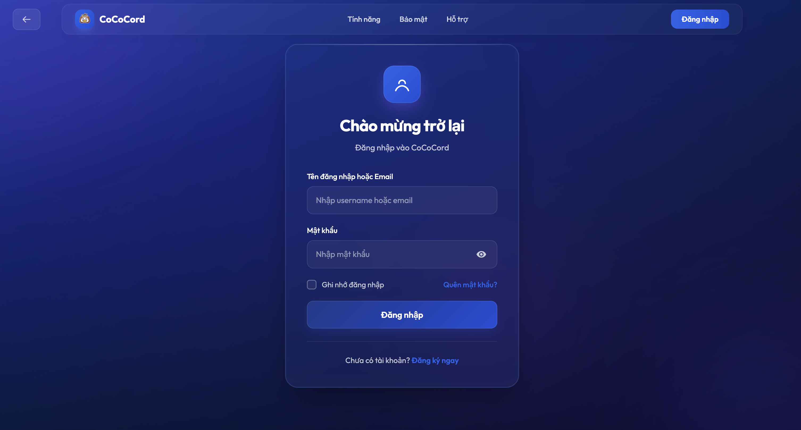
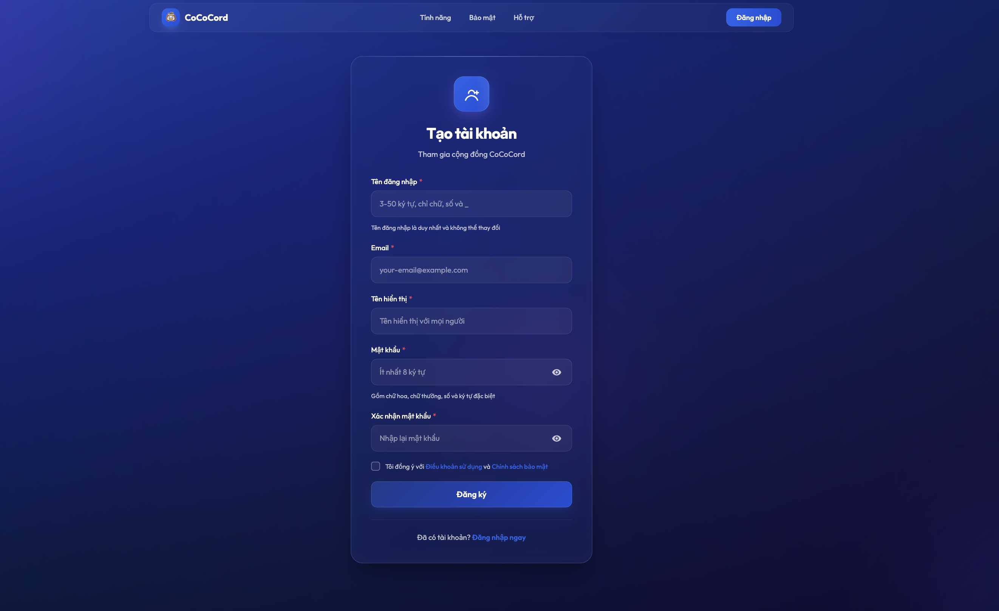
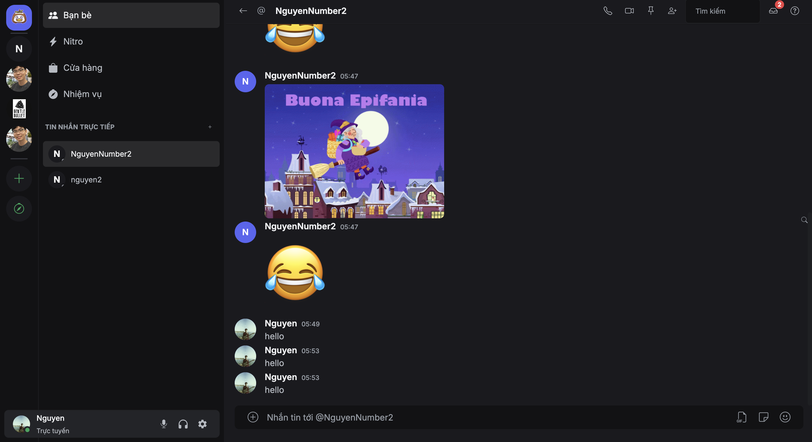
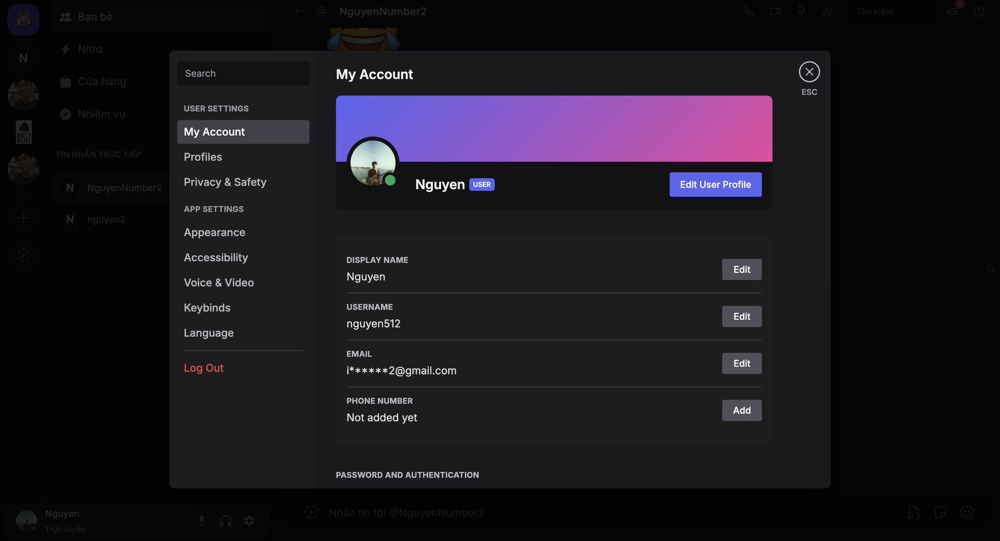
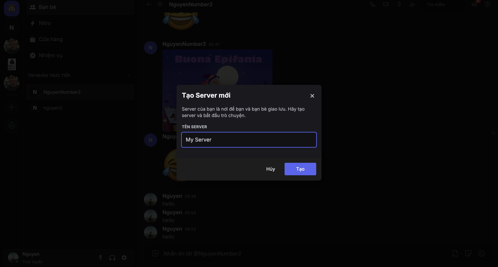
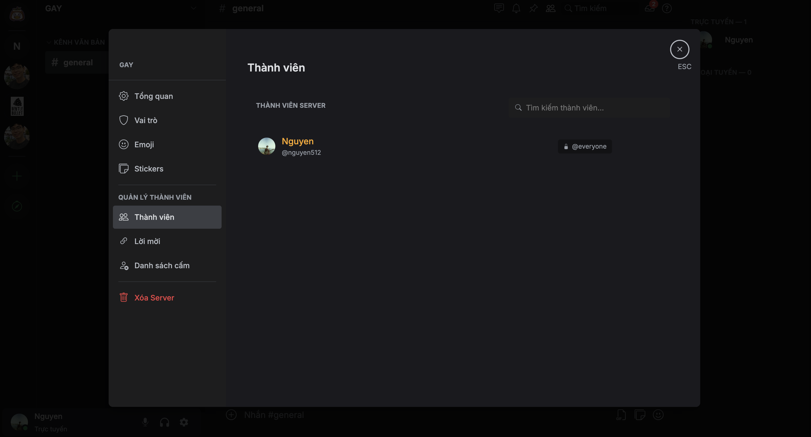

<div align="center">

  
  <h1>CoCoCord</h1>
  <p>
    <strong>Nền tảng giao tiếp thời gian thực</strong>
  </p>

  <p>
    <a href="https://spring.io/projects/spring-boot">
      
    </a>
    <a href="https://www.java.com/">
      
    </a>
    <a href="https://www.mysql.com/">
      
    </a>
    <a href="https://www.mongodb.com/">
      
    </a>
    <a href="https://redis.io/">
      
    </a>
  </p>
  

  

</div>

---

## 📖 Giới thiệu (Introduction)

**CoCoCord** không chỉ là một ứng dụng chat thông thường, mà là một **hệ sinh thái giao tiếp** được thiết kế để kết nối cộng đồng. Lấy cảm hứng từ Discord, CoCoCord mang đến trải nghiệm nhắn tin, gọi thoại và quản lý cộng đồng mượt mà, bảo mật và tốc độ cao.

Dự án là sự kết tinh của các công nghệ Java Web hiện đại nhất hiện nay, minh chứng cho khả năng xây dựng hệ thống **Real-time**, **High-concurrency** và **Scalable**.

---

## ✨ Tính năng Đột phá (Key Features)

<table>
  <tr>
    <td width="50%">
      <h3>⚡ Tốc độ & Real-time (Thời gian thực)</h3>
      <ul>
        <li>Hệ thống <strong>WebSocket (STOMP)</strong> tối ưu hóa, độ trễ tin nhắn dưới 50ms.</li>
        <li>Thông báo tức thì (Push Notifications) khi có tin nhắn mới, lời mời kết bạn.</li>
        <li>Trạng thái hoạt động (Presence) và Typing Indicator chính xác theo mili-giây.</li>
      </ul>
    </td>
    <td width="50%">
       <!-- [CHÈN GIF: Chat nhanh như chớp] -->
        
    </td>
  </tr>
  <tr>
    <td width="50%">
       
    </td>
    <td width="50%">
      <h3>🎙️ Voice Chat & Media</h3>
      <ul>
        <li>Đàm thoại âm thanh chất lượng cao (WebRTC P2P).</li>
        <li>Khả năng lọc tiếng ồn, tùy chỉnh Input/Output.</li>
        <li>Gửi file đa phương tiện (Ảnh, Video, Tệp tin) lên tới 25MB với preview thông minh.</li>
      </ul>
    </td>
  </tr>
    <tr>
    <td width="50%">
      <h3>🛡️ Quản trị Cộng đồng (Community)</h3>
      <ul>
        <li>Phân quyền role chi tiết (Admin, Mod, Member, Guest).</li>
        <li>Tạo Invite Link có thời hạn/số lượt dùng.</li>
        <li>Audit Log ghi lại mọi hành động quan trọng trong Server.</li>
      </ul>
    </td>
    <td width="50%">
       <!-- [CHÈN GIF: Server Settings & Roles] -->
        
    </td>
  </tr>
</table>

### 🛠️ Các tính năng khác
- **Hybrid Database**: Kết hợp sức mạnh ràng buộc của SQL và tốc độ của NoSQL.
- **Message Actions**: Reply, Edit, Soft-Delete, Reactions (Emoji).
- **Security**: JWT Rotation, CSRF Protection, XSS Filtering.

---

## 🛠️ Công nghệ sử dụng (Tech Stack)

### Backend (Java Spring Boot)
| Công nghệ | Phiên bản | Mô tả |
| :--- | :--- | :--- |
| **Java JDK** | 21 (LTS) | Ngôn ngữ core, tận dụng Virtual Threads |
| **Spring Boot** | 3.5.9 | Framework phát triển ứng dụng nhanh |
| **Spring Security** | 6.x | Bảo mật, Authentication & Authorization |
| **Spring Data JPA** | Latest | ORM, giao tiếp với MySQL |
| **Spring Data MongoDB**| Latest | Giao tiếp với MongoDB |
| **Spring WebSocket** | Latest | Xử lý kết nối Realtime (STOMP) |
| **JWT (jjwt)** | 0.12.6 | JSON Web Token cho Stateless Auth |
| **Lombok** | Latest | Giảm thiểu Boilerplate code |
| **Thumbnailator** | 0.4.20 | Xử lý, nén và resize ảnh |
| **Spring GraphQL** | Latest | (Experimental) API Query linh hoạt |

### Frontend (Client-side)
| Công nghệ | Mô tả |
| :--- | :--- |
| **JSP / JSTL** | Server-side Rendering view engine |
| **Sitemesh 3** | Layout & Decorator engine (Header, Footer, Sidebar) |
| **Tailwind CSS** | Utility-first CSS Framework (Styling chính) |
| **Bootstrap 5** | Grid system và Components bổ trợ |
| **Bootstrap Icons** | Hệ thống icon vector |
| **Vanilla JS** | Xử lý logic Client (ES6+ Modules) |
| **SockJS + StompWS** | Thư viện Client để kết nối WebSocket |

### Database & Infrastructure
| Công nghệ | Mô tả |
| :--- | :--- |
| **MySQL 8.0** | Hệ quản trị CSDL quan hệ (Users, Servers, Channels) |
| **MongoDB 6.0** | CSDL NoSQL (Lưu trữ Chat History, Logs) |
| **Redis** | In-memory Cache & Pub/Sub cho WebSocket Scaling |
| **Maven** | Quản lý phụ thuộc và Build tool |

---

## 🏗️ Kiến trúc Hệ thống (System Architecture)

Chúng tôi sử dụng mô hình Layered Architecture hiện đại, dễ dàng mở rộng sang Microservices.



---

## ⚡ Cài đặt & Triển khai (Installation)

### Yêu cầu hệ thống
| Phần mềm | Phiên bản tối thiểu |
| :--- | :--- |
| Java JDK | 21 LTS |
| Maven | 3.8+ |
| MySQL | 8.0 |
| MongoDB | 5.0+ |

### Chạy Local (Development)

1. **Khởi tạo Database**:
   - Tạo schema MySQL: `CREATE DATABASE cococord_db;`
   - (MongoDB tự động tạo khi chạy).

2. **Cài đặt dependencies**:
   ```bash
   mvn clean install
   ```

3. **Chạy ứng dụng**:
   ```bash
   mvn spring-boot:run
   ```

4. **Truy cập**:
   - App: `http://localhost:8080`

---

## Thư viện ảnh (Gallery)

| **Login Screen** | **Register Screen** |
|:---:|:---:|
|  |  |

| **Direct Message** | **User Settings** |
|:---:|:---:|
|  |  |

| **Create Server Modal** | **Channel Settings** |
|:---:|:---:|
|  |  |


---


<div align="center">
  <p>Made by <br/> <strong>Phùng Lê Thanh Quân</strong> <br/>
  <strong>Đặng Gia Nguyên</strong> <br/> 
  <strong>Nguyễn Đức Thịnh</strong> </p>
  <p>
    <a href="#">
      
    </a>
    <a href="#">
      
    </a>
    <a href="#">
      
    </a>
  </p>
</div>
