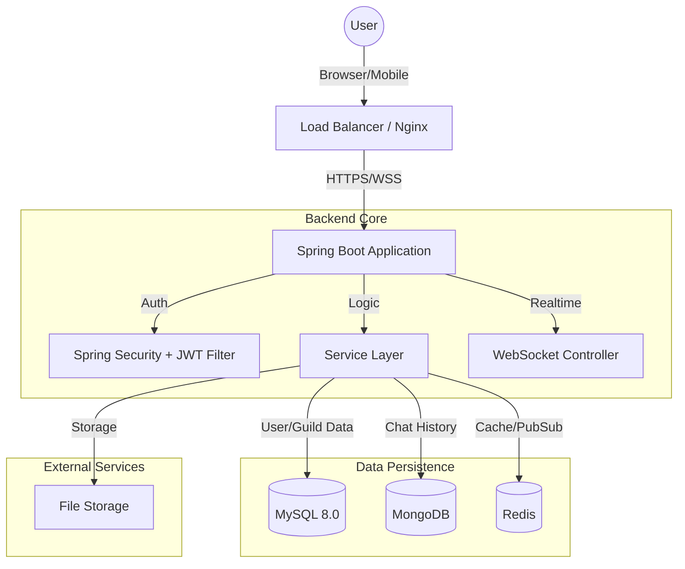

<div align="center">

  
  <h1>✨ CoCoCord</h1>
  <p>
    <strong>Nền tảng giao tiếp thời gian thực</strong>
  </p>

  <p>
    <a href="https://spring.io/projects/spring-boot">
      
    </a>
    <a href="https://www.java.com/">
      
    </a>
    <a href="https://www.mysql.com/">
      
    </a>
    <a href="https://www.mongodb.com/">
      
    </a>
    <a href="https://redis.io/">
      
    </a>
  </p>
  

  <!-- [CHÈN GIF: Demo tổng quan (Hero Video)] -->
  

</div>

---

## 📖 Giới thiệu (Introduction)

**CoCoCord** không chỉ là một ứng dụng chat thông thường, mà là một **hệ sinh thái giao tiếp** được thiết kế để kết nối cộng đồng. Lấy cảm hứng từ Discord, CoCoCord mang đến trải nghiệm nhắn tin, gọi thoại và quản lý cộng đồng mượt mà, bảo mật và tốc độ cao.

Dự án là sự kết tinh của các công nghệ Java Web hiện đại nhất hiện nay, minh chứng cho khả năng xây dựng hệ thống **Real-time**, **High-concurrency** và **Scalable**.

---

## ✨ Tính năng Đột phá (Key Features)

<table>
  <tr>
    <td width="60%">
      <h3>� Tốc độ & Real-time (Thời gian thực)</h3>
      <ul>
        <li>Hệ thống <strong>WebSocket (STOMP)</strong> tối ưu hóa, độ trễ tin nhắn dưới 50ms.</li>
        <li>Thông báo tức thì (Push Notifications) khi có tin nhắn mới, lời mời kết bạn.</li>
        <li>Trạng thái hoạt động (Presence) và Typing Indicator chính xác theo mili-giây.</li>
      </ul>
    </td>
    <td width="40%">
       <!-- [CHÈN GIF: Chat nhanh như chớp] -->
        
    </td>
  </tr>
  <tr>
    <td width="40%">
       <!-- [CHÈN GIF: Thao tác Voice Chat] -->
       
    </td>
    <td width="60%">
      <h3>🎙️ Voice Chat & Media</h3>
      <ul>
        <li>Đàm thoại âm thanh chất lượng cao (WebRTC P2P).</li>
        <li>Khả năng lọc tiếng ồn, tùy chỉnh Input/Output.</li>
        <li>Gửi file đa phương tiện (Ảnh, Video, Tệp tin) lên tới 25MB với preview thông minh.</li>
      </ul>
    </td>
  </tr>
    <tr>
    <td width="60%">
      <h3>🛡️ Quản trị Cộng đồng (Community)</h3>
      <ul>
        <li>Phân quyền role chi tiết (Admin, Mod, Member, Guest).</li>
        <li>Tạo Invite Link có thời hạn/số lượt dùng.</li>
        <li>Audit Log ghi lại mọi hành động quan trọng trong Server.</li>
      </ul>
    </td>
    <td width="40%">
       <!-- [CHÈN GIF: Server Settings & Roles] -->
        
    </td>
  </tr>
</table>

### 🛠️ Các tính năng khác
- **Hybrid Database**: Kết hợp sức mạnh ràng buộc của SQL và tốc độ của NoSQL.
- **Message Actions**: Reply, Edit, Soft-Delete, Reactions (Emoji).
- **Security**: JWT Rotation, CSRF Protection, XSS Filtering.
- **UI/UX**: Dark Mode mặc định, Responsive 100% trên Mobile/Tablet.

---

## 🏗️ Kiến trúc Hệ thống (System Architecture)

Chúng tôi sử dụng mô hình Layered Architecture hiện đại, dễ dàng mở rộng sang Microservices.



---

## 📂 Cấu trúc Thư mục (Folder Structure)

```bash
cococord-website/
├── src/
│   ├── main/
│   │   ├── java/vn/cococord/
│   │   │   ├── config/          # Cấu hình (Security, WebSocket, Redis)
│   │   │   ├── controller/      # REST & View Controllers
│   │   │   ├── dto/             # Data Transfer Objects (Request/Response)
│   │   │   ├── entity/          # JPA & Mongo Entities
│   │   │   ├── repository/      # Data Access Layer
│   │   │   ├── security/        # JWT Providers & Filters
│   │   │   ├── service/         # Business Logic
│   │   │   └── utils/           # Helper classes
│   │   ├── resources/
│   │   │   ├── static/          # CSS, JS, Images (Public)
│   │   │   ├── templates/       # Email Templates
│   │   │   └── application.properties
│   │   └── webapp/WEB-INF/      # JSP Views & Decorators
│   └── test/                    # Unit & Integration Tests
├── pom.xml                      # Maven Dependencies
└── README.md                    # Tài liệu dự án
```

---

## ⚡ Cài đặt & Triển khai (Installation)

### Yêu cầu hệ thống
| Phần mềm | Phiên bản tối thiểu |
| :--- | :--- |
| Java JDK | 21 LTS |
| Maven | 3.8+ |
| MySQL | 8.0 |
| MongoDB | 5.0+ |

### Biến môi trường (Environment Variables)
Tạo file cấu hình hoặc set environment variables:

| Biến | Mô tả | Mặc định |
| :--- | :--- | :--- |
| `DB_HOST` | MySQL Host | `localhost` |
| `DB_PORT` | MySQL Port | `3306` |
| `MONGO_URI` | MongoDB Connection String | `mongodb://localhost:27017/cococord` |
| `JWT_SECRET` | Secret key ký Token | `(random_string)` |

### Chạy Local (Development)

1. **Khởi tạo Database**:
   - Tạo schema MySQL: `CREATE DATABASE cococord_db;`
   - (MongoDB tự động tạo khi chạy).

2. **Cài đặt dependencies**:
   ```bash
   mvn clean install
   ```

3. **Chạy ứng dụng**:
   ```bash
   mvn spring-boot:run
   ```

4. **Truy cập**:
   - App: `http://localhost:8080`
   - Admin: `http://localhost:8080/admin`

---

## � Thư viện ảnh (Gallery)

<details>
<summary><strong>👇 Xem thêm ảnh chụp màn hình chi tiết</strong></summary>
<br/>

| **Login Screen** | **Register Screen** |
|:---:|:---:|
|  |  |

| **Direct Message** | **User Settings** |
|:---:|:---:|
|  |  |

| **Create Server Modal** | **Channel Settings** |
|:---:|:---:|
|  |  |

</details>

---

## 🤝 Đóng góp (Contributing)

Chúng tôi rất hoan nghênh mọi đóng góp! Vui lòng đọc kỹ hướng dẫn:

1. Fork dự án.
2. Tạo nhánh tính năng (`git checkout -b feature/AmazingFeature`).
3. Commit thay đổi (`git commit -m 'Add some AmazingFeature'`).
4. Push lên nhánh (`git push origin feature/AmazingFeature`).
5. Mở Pull Request.

---

## � License

Dự án này được cấp phép theo giấy phép **MIT**. Xem file `LICENSE` để biết thêm chi tiết.

---

<div align="center">
  <p>Thực hiện bởi <strong>Nguyễn Văn A</strong> và nhóm phát triển.</p>
  <p>
    <a href="#">
      
    </a>
    <a href="#">
      
    </a>
    <a href="#">
      
    </a>
  </p>
</div>
